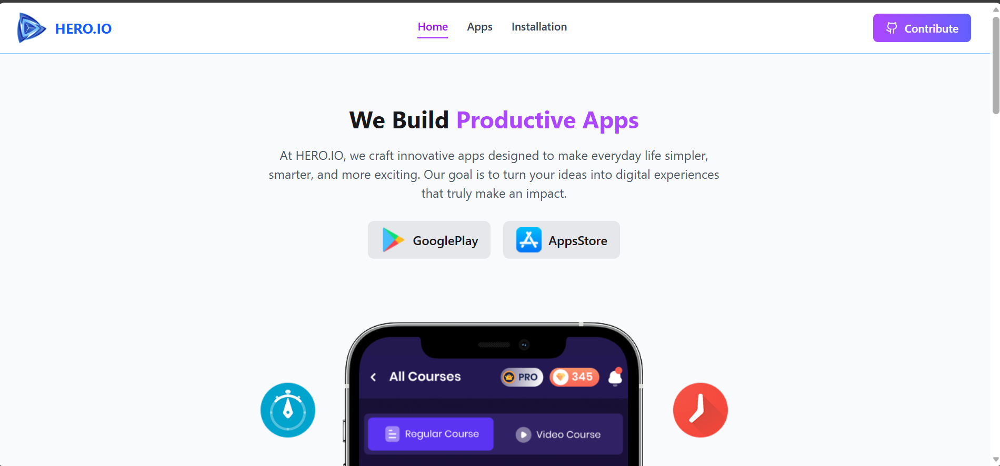

# 📱 My App Store

> **My App Store** is a web application where users can browse, search, and install apps easily. View app details like downloads, ratings, reviews, and descriptions, and manage installed apps right in your browser.  

It’s fully responsive, works on desktop and mobile, and features smooth animations for a fun user experience.

---

## 🚀 Features
- Browse trending apps and all available apps 📊  
- Search apps in real-time 🔍  
- View app details: downloads, ratings, reviews, and description 📝  
- Install apps and save them in your browser 💾  
- Uninstall apps anytime ❌  
- Responsive design for all devices 📱💻  
- Animated loading spinner and smooth UI transitions ✨  

---

## 🛠️ Technologies Used

  
  
  
  
- LocalStorage – for saving installed apps  
- Vite – for fast development  

---

## 📷 Screenshot / Demo

---
